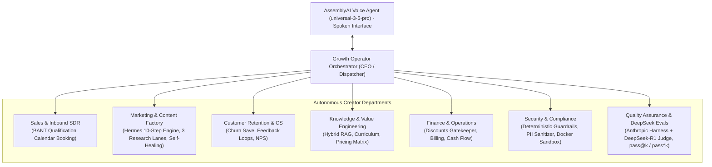

# AI Growth Operator Voice OS — Master Technical Architecture

## 1. System Overview

**AI Growth Operator Voice OS** is an enterprise-grade, voice-first revenue engine engineered for online creators, educators, and digital product agencies. It automates high-stakes inbound SDR qualification, outbound reactivation campaigns, customer churn intervention, and autonomous content generation using real-time voice interactions.

The platform unites five architectural pillars:
1. **AssemblyAI Voice Infrastructure:** Native managed Voice Agent API (`universal-3-5-pro`) with real-time speech-in/speech-out streaming, low-latency turn detection, flat tool-calling schemas, and sub-second barge-in cancellation.
2. **Production GenAI Systems Engineering:** Hybrid RAG & re-ranking, Anthropic Evals harness ($pass@k$ and $pass^k$), distributed turn-level observability (TTFA, turn latency), multi-layer caching with TTL invalidation, and deterministic guardrails (*"Model proposes, application enforces"*).
3. **DeepSeek Harness & Model-as-a-Judge Reasoning:** Integrated with [DeepSeek Harness (`dsh`)](https://github.com/deepseek-ai/deepseek-harness) utilizing `deepseek-reasoner` (DeepSeek-R1) and `deepseek-chat` (DeepSeek-V3) for deep mathematical/tactical analysis, multi-agent arbitration, and high-fidelity Model-as-a-Judge conversational grading.
4. **Hermes Content Factory & Autonomous Self-Healing:** Codified implementation of [Raja Ashok's 10-step Hermes Content Factory Blueprint](docs/CONTENT_FACTORY_PIPELINE.md). Resolves the 15–45s content generation latency hurdle via instant spoken dispatch in AssemblyAI followed by 3 parallel research lanes, multi-asset drafting (X threads, newsletters, webinars), and an automated self-healing error analysis and repair loop.
5. **Cloud-Native Docker Substrate & Elite Operator UX:** Modular microservices architecture addressing security and orchestration challenges from Docker's State of Agentic AI Report, paired with a dark glassmorphic command console featuring 60 FPS bidirectional audio waveforms, live diarized transcript HUD, real-time CRM Kanban, and the Hermes Content Studio.

---

## 1.1 The 7-Department Autonomous Agency Org Chart

Inspired by the "Build Your Whole Team with Claude" framework, the GrowthVoice OS doesn't just run simple API scripts; it structures the creator's backend into autonomous departments orchestrated by the Voice Agent API:



## 2. End-to-End Sequence & Data Flow

```
[Web User / Mic]        [AudioWorklet]       [Orchestrator Gateway]      [AssemblyAI WS]        [Agent Tools / CRM]
       |                      |                         |                        |                       |
       | 1. Connect Session   |                         |                        |                       |
       |----------------------------------------------->|                        |                       |
       |                      |                         | 2. POST /v1/token      |                       |
       |                      |                         |----------------------->|                       |
       |                      |                         |    (Mint Temp Token)   |                       |
       |                      |                         |<-----------------------|                       |
       |                      |                         |                        |                       |
       | 3. Connect WS with Token                       |                        |                       |
       |------------------------------------------------------------------------>|                       |
       |                      |                         |                        |                       |
       |                      |                         | 4. session.update      |                       |
       |                      |                         |    (Tools, Prompts)    |                       |
       |                      |                         |----------------------->|                       |
       |                      |                         |<-----------------------|                       |
       |                      |                         |    session.ready       |                       |
       |                      |                         |                        |                       |
       | 5. Stream Mic Audio  |                         |                        |                       |
       |==== PCM16 24kHz =====>| (50ms chunks base64)   |                        |                       |
       |                      |--- input.audio -------->------------------------>|                       |
       |                      |                         |                        | (STT + VAD + LLM)     |
       |                      |                         |<-- reply.started ------|                       |
       |                      |                         |<-- reply.audio (data) -|                       |
       |<==== Spoken Audio ===|<-- Web Audio Queue -----|                        |                       |
       |                      |                         |<-- reply.done ---------|                       |
       |                      |                         |                        |                       |
       |                      |                         |<-- tool.call (JSON) ---|                       |
       |                      |                         |                        |                       |
       |                      |                         | 6. Guardrail Check     |                       |
       |                      |                         | 7. Semantic/TTL Cache  |                       |
       |                      |                         | 8. Execute Tool -------|---------------------->|
       |                      |                         | 9. Enforce Business    |<----------------------|
       |                      |                         |    Rule & Update CRM   |                       |
       |                      |                         |                        |                       |
       |                      |                         | 10. tool.result ------>|                       |
       |                      |                         |                        | (LLM resumes turn)    |
       |                      |                         |<-- reply.audio (data) -|                       |
       |<==== Spoken Audio ===|<-- Web Audio Queue -----|                        |                       |
       |                      |                         |                        |                       |
       | 11. User Barge-in    |                         |                        |                       |
       |----------------------------------------------->| input.speech.started   |                       |
       |                      | (Abort Playback Source) | reply.done(interrupted)|                       |
       |                      |                         | Discard Pending Tool   |                       |
       |                      |                         |                        |                       |
       | 12. End Call         |                         |                        |                       |
       |----------------------------------------------->|-- { "type":"Terminate"}> (Session Closes)     |
```

---

## 3. Pillar-by-Pillar Architectural Design

### 3.1 Pillar 1: AssemblyAI Native Integration Architecture

* **WebSocket Gateway:**
  * Endpoint: `wss://agents.assemblyai.com/v1/ws`
  * Model: `universal-3-5-pro` (real-time, ~1s end-to-end turn latency, native code-switching across 18 languages).
  * Audio Specification: Single-channel (mono), 16-bit signed Linear PCM at 24,000 Hz.
  * Message Structure: JSON-encapsulated events. Mic frames sent as:
    ```json
    { "type": "input.audio", "audio": "<base64_encoded_pcm16_chunk>" }
    ```
  * Output Frames received as:
    ```json
    { "type": "reply.audio", "data": "<base64_encoded_pcm16_chunk>" }
    ```
    *(Note the field-name asymmetry: `audio` for input, `data` for output).*

* **Ephemeral Token Minting (Zero Client Secrets):**
  * Browsers never possess the raw `ASSEMBLYAI_API_KEY`.
  * The backend exposes `POST /api/voice/token`, which calls:
    ```http
    POST https://agents.assemblyai.com/v1/token?expires_in_seconds=300&max_session_duration_seconds=3600
    Authorization: Bearer <ASSEMBLYAI_API_KEY>
    ```
  * Client connects directly to `wss://agents.assemblyai.com/v1/ws?token=<TOKEN>`.

* **Dynamic Context Injection:**
  * After each turn, the orchestrator issues `UpdateConfiguration` over the WebSocket:
    * `agent_context`: Injects the agent's latest spoken sentence to bias the acoustic model for short responses ("yes", "pro plan", "refund").
    * `keyterms_prompt`: Dynamically updates creator course names, pricing tiers, and mentor names (up to 100 terms in real time).

* **Interruption & Playback Synchronization:**
  * When the user speaks while the agent is replying, AssemblyAI fires `input.speech.started` followed by `reply.done` with `"status": "interrupted"`.
  * The client immediately calls `AudioContext.suspend()` or flushes the scheduled audio buffer queue, ensuring the speaker never hears stale synthesized speech.

---

### 3.2 Pillar 2: Production GenAI Systems Architecture

#### A. Hybrid RAG & Knowledge Retrieval
* **Data Sources:** Creator product catalog, course syllabus, mentorship tiers, refund policy, and objection-handling playbooks.
* **Pipeline:**
  1. Chunking: Domain-aware semantic chunking (250 tokens per chunk with 50-token overlap).
  2. Embeddings: High-dimensional semantic vectors (`text-embedding-3-small` / Universal embeddings).
  3. Hybrid Search: Reciprocal Rank Fusion (RRF) combining dense vector similarity + BM25 sparse keyword matching.
  4. Cross-Encoder Reranking: Top 15 candidate chunks reranked to Top 3 high-precision context snippets.
  5. Metadata Filtering: Automatic scoping by `access_tier`, `category`, and `freshness_timestamp`.

#### B. Anthropic Evals Framework (Evaluation Harness)
* **Core Primitives:**
  * **Task:** Standardized test scenario (e.g. `lead_qualification_happy_path`, `aggressive_price_objection`, `churn_save_within_policy`, `injection_jailbreak_attempt`).
  * **Trial:** Execution of the simulated conversation against the agent.
  * **Transcript:** Full serialized exchange of user and agent turns, tool invocations, and timings.
  * **Grader:** Combination of:
    * *Code-Based Graders (Deterministic):* Schema validation, BANT score presence, CRM record creation, discount limit verification.
    * *Model-Based Graders (LLM Judge):* Evaluates tone, empathy, professional demeanor, and conciseness on a 1–5 rubric.
  * **Outcome:** Aggregate report calculating:
    $$\text{pass@k} = 1 - (1 - p)^k$$
    $$\text{pass}^k = p^k$$
    Evaluating both discovery of solutions and consistency across $k=5$ runs.

#### C. Turn-Level Observability & Telemetry
* Turn Metrics:
  * **TTFA (Time-to-First-Audio):** Latency from user end-of-turn silence detection to first audio byte emitted by agent.
  * **Turn Latency Percentiles:** p50, p95, p99 across speech turns.
  * **Tool Execution Latency:** Time taken by backend microservices to execute CRM/RAG queries.
  * **Token & Cost Ledger:** Precise calculation of input/output tokens and cost per call.

#### D. Multi-Layer Caching Strategy
* **Layer 1 (Exact FAQ Cache):** In-memory/Redis hash lookup for deterministic questions (e.g. "What is the refund window?").
* **Layer 2 (Semantic Cache):** Cosine similarity lookup ($\text{threshold} \ge 0.94$) for high-frequency objections.
* **Layer 3 (Tool & CRM Cache):** Short-lived TTL (60s) cache for calendar slot availability and customer profile data.
* **Principle:** Freshness strictly prioritized over speed for financial/booking transactions.

#### E. Deterministic Guardrails & Business Enforcement
* **Input Layer:**
  * Prompt Injection Sanitization: Scans incoming transcript turns for prompt override attempts (`ignore previous instructions`, etc.).
  * PII Masking: Redacts credit card numbers and sensitive credentials before logging.
* **Output Layer & Business Policy Gatekeeper:**
  * **"Model proposes, application decides."**
  * If the voice agent proposes a retention discount:
    * Proposed $\le 15\% \to$ Approved autonomously.
    * $15\% < \text{Proposed} \le 20\% \to$ Clamped to $20\%$ for VIP customers only.
    * Proposed $> 20\% \to$ Clamped to max allowed policy limit ($15\%$) and flagged for creator review with an added non-cash incentive (e.g. bonus 1-on-1 strategy audit).

---

### 3.3 Pillar 3: DeepSeek Harness & Model-as-a-Judge Reasoning Architecture

* **Integration with [`deepseek-ai/deepseek-harness`](https://github.com/deepseek-ai/deepseek-harness):**
  * Integrated directly through [`apps/orchestrator/src/services/deepseekService.ts`](apps/orchestrator/src/services/deepseekService.ts).
  * **Dual-Model Specialization:**
    1. `deepseek-chat` (DeepSeek-V3): High-throughput semantic extractions, objection classification, and fast contextual queries.
    2. `deepseek-reasoner` (DeepSeek-R1): Deep Chain-of-Thought (CoT) synthesis, multi-source contradiction resolution, and self-healing code/content verification loops.
* **Anthropic Model-as-a-Judge (`packages/evals/src/deepseekJudge.ts`):**
  * Implements multi-dimensional qualitative grading across 4 criteria:
    * *Empathy & Rapport:* 1–5 score evaluating active listening and emotional attunement.
    * *Conciseness for Voice:* 1–5 score penalizing verbose walls of text unsuited for real-time speech.
    * *Business Alignment:* 1–5 score measuring adherence to creator pricing and calendar booking goals.
    * *Zero Hallucination:* Strict boolean certification that no unverified claims or terms were invented.
  * DeepSeek-R1 outputs structured rationale explaining exact rubric scoring before issuing final verdict.

---

### 3.4 Pillar 4: Hermes Content Factory & Autonomous Self-Healing Pipeline

* **Full 10-Step Blueprint ([`docs/CONTENT_FACTORY_PIPELINE.md`](docs/CONTENT_FACTORY_PIPELINE.md)):**
  1. **01. Brief Formulation:** Voice agent extracts core topic, target audience, and objection angle from live call.
  2. **02. Strategy Selection:** Maps tone to Creator Voice DNA (educational, contrarian, direct-response).
  3. **03. Control Plane & Budgets:** Allocates token budget (capped at $0.05 per pack) and assigns job ID.
  4. **04. Capability Packs:** Activates X/Twitter Thread, Long-form Newsletter, and Webinar Pitch modules.
  5. **05. 3 Parallel Research Lanes:**
     * *Lane A (Creator RAG):* Pulls pricing matrices, course syllabi, and guarantee terms via [`ragEngine.ts`](apps/orchestrator/src/services/ragEngine.ts).
     * *Lane B (Market Signals):* Extracts audience pain points, industry trends, and competitor benchmarks.
     * *Lane C (Community Objections):* Mines recent inbound voice call logs and customer CRM interactions.
  6. **06. Synthesis & Asset Drafting:** DeepSeek-R1 merges research lanes into 3 co-ordinated deliverables.
  7. **07. Production Packaging:** Structures outputs into clean markdown with platform-specific meta tags.
  8. **08. Autonomous Self-Healing Verification Loop:**
     * *Validation 1 (Character Limit):* Asserts tweet length $\le 280$ chars. If exceeded, analyzes syntax and compresses autonomously.
     * *Validation 2 (Guarantee Integrity):* Asserts inclusion of 14-day refund policy. If absent, injects exact verified language.
     * *Validation 3 (PII Redaction):* Ensures zero leaked phone numbers, emails, or credentials.
  9. **09. Human Approval Boundary:** Content Studio holds assets in `REVIEW_PENDING` until creator grants one-click approval.
  10. **10. Telemetry & Publishing:** Emits live WebSocket telemetry to [`ContentFactoryStudio.tsx`](apps/web/src/components/ContentFactoryStudio.tsx) and stores audit trail.

---

### 3.5 Pillar 5: Cloud-Native Container Substrate & Elite Operator UX

* **Microservices Topology ([`docker-compose.yml`](docker-compose.yml)):**
  * `web-console`: React 18 + Vite frontend container serving the operator dashboard, AudioWorklet streaming, and Content Studio.
  * `orchestrator-gateway`: Node.js / TypeScript service managing AssemblyAI WebSocket bridges, auth token minting, and tool dispatching.
  * `agent-runtime`: Python / FastAPI service providing sandboxed tool implementations (Lead Gen, SDR, RAG search, Retention engine).
  * `redis-cache`: High-throughput in-memory store for exact caching, semantic cache embeddings, and session state.
  * `crm-db`: Relational store (SQLite / PostgreSQL) holding contacts, leads, booking appointments, and call logs.
* **Zero-Trust Security & Sandboxed Tooling:**
  * Tools execute in unprivileged containers with isolated network bridges.
  * External API keys are kept strictly within server-side environment variables (`.env`).
* **Elite Operator UI/UX Design:**
  * Dark luxury theme with deep slate backgrounds (`#0B0F17`), frosted glass panels (`backdrop-blur-md bg-white/5`), vibrant emerald accents for active voice channels, and cyan/violet audio indicators.
  * 60 FPS HTML5 Canvas engine analyzing real-time `AnalyserNode` frequency and time-domain data.
  * Dynamic CRM Kanban board updating as leads are created and qualified during live voice calls.
  * Real-time Evals Runner interface displaying automated test suite results and $pass^k$ metrics.
  * Live Hermes Content Studio rendering real-time progress bars, research lane insights, self-healing badges, and one-click publishing.

---

## 4. Key Source Code References

* **Voice Agent Tool Schemas:** [`apps/orchestrator/src/tools/registry.ts`](apps/orchestrator/src/tools/registry.ts)
* **Tool Dispatcher & Spoken Fast-Response:** [`apps/orchestrator/src/tools/dispatcher.ts`](apps/orchestrator/src/tools/dispatcher.ts)
* **Hermes Content Factory Engine:** [`apps/orchestrator/src/services/contentFactoryEngine.ts`](apps/orchestrator/src/services/contentFactoryEngine.ts)
* **DeepSeek Connector:** [`apps/orchestrator/src/services/deepseekService.ts`](apps/orchestrator/src/services/deepseekService.ts)
* **Anthropic Evals Runner & DeepSeek Judge:** [`packages/evals/src/runner.ts`](packages/evals/src/runner.ts) and [`packages/evals/src/deepseekJudge.ts`](packages/evals/src/deepseekJudge.ts)
* **Web Command Console:** [`apps/web/src/App.tsx`](apps/web/src/App.tsx)
* **Hermes Content Studio Component:** [`apps/web/src/components/ContentFactoryStudio.tsx`](apps/web/src/components/ContentFactoryStudio.tsx)
* **Full Shared Data Contracts:** [`packages/shared/src/types.ts`](packages/shared/src/types.ts)

