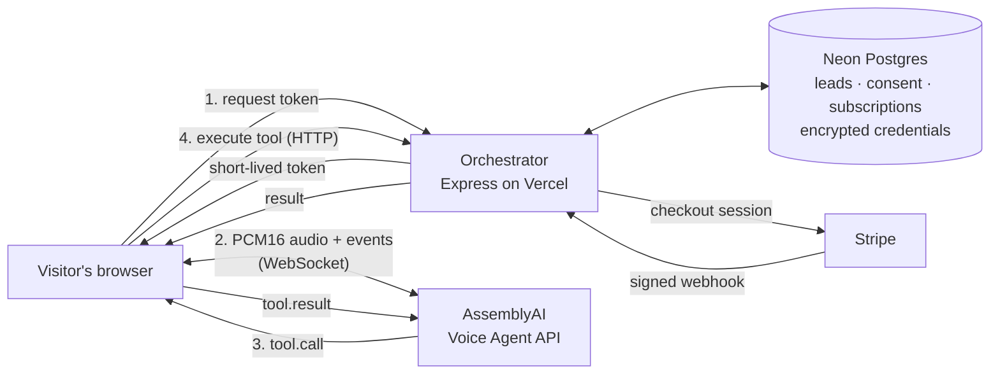

# GrowthVoice OS

**A voice agent that answers your website around the clock, qualifies the visitor out loud, and writes the lead into your CRM — with US AI-disclosure and recording-consent rules built in.**

Built on the [AssemblyAI Voice Agent API](https://www.assemblyai.com/products/voice-agent-api) for the AssemblyAI Voice Agent Hackathon.

**[Live demo](https://growthvoice-os.vercel.app)** · **[Embeddable widget](https://growthvoice-os.vercel.app/widget-preview)** · [Pitch deck](docs/submission/GrowthVoice-OS-Pitch-Deck.pdf) · [Submission notes](docs/submission/SUBMISSION.md)

[](LICENSE)

---

## The problem

Inbound interest arrives whenever the visitor has time — evenings, weekends, other time zones. Most B2B sites meet it with a static contact form and a reply the next business day, by which point the visitor has moved on. A human SDR on nights and weekends is expensive; a text chatbot is easy to ignore.

## What GrowthVoice OS does

1. **Answers in voice, in the browser.** A visitor clicks, speaks, and is heard. No phone number, no download.
2. **Takes real actions mid-conversation.** The agent calls tools as it talks — creating the lead, recording budget, authority, need and timeline, capturing a consultation request — and those land in a Postgres-backed CRM while the call is still going.
3. **Handles US disclosure and consent before it listens.** It tells the visitor they are talking to an AI, and in all-party-consent states it asks permission before anything is transcribed — then keeps an audit record of that consent.

## Try it

1. Open **[growthvoice-os.vercel.app](https://growthvoice-os.vercel.app)** and start a voice call. Allow microphone access.
2. You will hear the AI disclosure first. Say who you are, your company and what you are looking for.
3. Watch the CRM: when the agent calls `create_or_update_lead` and `qualify_lead`, the lead appears and its score updates.

To see it as a customer would embed it, open the **[widget preview](https://growthvoice-os.vercel.app/widget-preview)** — a sample third-party page running the one-line `embed.js` snippet.

> The public demo runs Stripe in **test mode** and in open demo mode (there is no login yet). Use test card `4242 4242 4242 4242`, and don't store real credentials there.

## How it uses AssemblyAI

The whole conversation runs on the **Voice Agent API** — speech recognition, turn detection, LLM reasoning, voice output and tool calling on one WebSocket.

| Capability | How it is used |
| :--- | :--- |
| **Ephemeral tokens** | The orchestrator mints a short-lived token server-side (`POST /api/voice/token`). The API key never reaches the browser. |
| **Direct browser streaming** | The browser captures 24 kHz mono PCM16 and streams it straight to `wss://agents.assemblyai.com/v1/ws`. Audio never passes through our servers. |
| **`session.update`** | Sets the system prompt, a greeting that opens with the legally required AI disclosure, the voice, and turn-detection settings. |
| **Tool calling** | Registers **7 tools** as JSON-Schema functions. Verified against the live API: the server echoes all 7 back in `session.updated`. |
| **`tool.call` → `tool.result`** | Each call executes on the orchestrator over HTTP and its result returns as `tool.result`, so the agent keeps talking with real data. |
| **Barge-in** | `interrupt_response: true`; when the agent reports an interrupted reply, local playback stops so the visitor is heard. |

The seven tools: `create_or_update_lead`, `qualify_lead`, `enrich_prospect_dossier`, `schedule_growth_consultation`, `get_product_knowledge`, `process_retention_offer`, `run_content_factory`.

## Architecture



- **Frontend** — React 18, Vite, Tailwind (`apps/web`).
- **Orchestrator** — Node, Express, TypeScript (`apps/orchestrator`). Mints voice tokens, executes tools, enforces compliance, handles billing.
- **Data** — Neon Postgres via Drizzle. Leads, churn-risk members, subscriptions, consent records and third-party credentials all persist; credentials are AES-256-GCM encrypted at rest.
- **Billing** — Stripe Checkout in subscription mode. A plan activates only from a signature-verified webhook.
- **Deploy** — one Vercel project serves the frontend and the API from the same origin.

## US compliance layer

Because the agent transcribes visitors on third-party websites, it is built around the rules that apply in the US:

- **AI disclosure before substantive exchange** — prepended to the greeting server-side, so a client cannot open a session without it (California AB 2905; Texas SB 140 requires disclosure within 30 seconds).
- **Explicit opt-in in the 13 all-party-consent states** — CA, CT, DE, FL, IL, MD, MA, MI, MT, NV, NH, PA and WA — where real-time transcription can count as interception.
- **Strictest policy when the location is unknown.**
- **Append-only consent records**, persisted before the call starts: region, requirement, disclosure text and timestamps.

> This is an engineering implementation of published statutes, **not legal advice**. Have counsel review the disclosure copy before deploying for real customers.

## Pricing

| Plan | Monthly | Annual (per month) | Voice minutes included | Overage |
| :--- | ---: | ---: | ---: | ---: |
| **Starter** | $149 | $119 | 500 | $0.30 / min |
| **Pro** | $449 | $359 | 1,500 | $0.25 / min |
| **Enterprise** | $1,497 | $1,197 | 5,000 | $0.20 / min |

**Unit economics.** The Voice Agent API costs **$4.50/hour ($0.075/min), all-in**. After Stripe's fees, every tier keeps about **72% gross margin on monthly billing (66% annual) even if the customer uses every included minute** — typical usage is lower, so real margins run higher. Overage never sells below cost, and a test in the suite fails if a price change breaks these floors.

**Break-even.** At a $3,500 average contract value, **one additional closed deal every 7.8 months pays for Pro.** That depends only on price and deal size, not on any conversion assumption. The in-app calculator models the rest from inputs the prospect sets (visitor volume, voice conversion, close rate); nothing in it is a measured result.

## What is real today

| Real | Not built yet |
| :--- | :--- |
| Browser voice calls on the AssemblyAI Voice Agent API | Multi-tenant login and accounts |
| Tool calls that create and qualify CRM leads | Usage metering from live calls |
| Embeddable widget running real voice sessions | Per-platform credential verification |
| AI disclosure and consent gating, with persisted records | Calendar integration (bookings are recorded on the lead) |
| Postgres persistence and encrypted credentials | Measured latency (no latency figures are claimed) |
| Stripe Checkout with webhook-driven activation (test mode) | Embedding-based retrieval (knowledge lookup is keyword-based) |
| X and LinkedIn publishing when enabled and connected; Substack via webhook | YouTube publishing |

Every publish receipt carries `isSimulated`, which is true unless a real API call succeeded. The full capability matrix, including what each feature falls back to, is in [CLAUDE.md](CLAUDE.md).

## Run it locally

Requires Node 20.

```bash
git clone https://github.com/dev4-gpt/VoiceAI.git
cd VoiceAI
npm install
cp .env.example .env        # then fill in the keys below
npm run dev:orchestrator    # API on http://localhost:4000
npm run dev:web             # console on http://localhost:3000
```

| Variable | Needed for |
| :--- | :--- |
| `ASSEMBLYAI_API_KEY` | Voice. Without it, calls are refused with `503 VOICE_UNCONFIGURED`. |
| `DEEPSEEK_API_KEY` | Typed chat and the content pipeline. Without it, replies are clearly flagged placeholders. |
| `DATABASE_URL` | Persistence. Without it, the app runs in memory and says so. |
| `MASTER_KEY` | Encrypting stored credentials. Without it, credentials are never persisted. |
| `STRIPE_SECRET_KEY`, `STRIPE_WEBHOOK_SECRET` | Checkout and plan activation. |
| `WIDGET_ALLOWED_ORIGINS` | Sites allowed to embed the widget. Unset allows any site (fine for a demo). |

Create the tables with `npx drizzle-kit push` from `apps/orchestrator`, with `DATABASE_URL` exported. Docker also works: `docker compose up --build`.

## Tests

```bash
npm test --workspace apps/orchestrator   # 63 tests
npm test --workspace apps/web
```

Coverage includes the XSS escaping in the page compiler, encryption tamper detection and wrong-key rejection, the `isSimulated` contract, webhook-driven entitlement (non-paying Stripe statuses grant no minutes), the pricing margin floors, and the ROI model's refusal to count pipeline as revenue.

## Project layout

```
apps/
  web/            React console, pricing, CRM, content studio
  orchestrator/   Express API: voice tokens, tools, compliance, billing, persistence
    src/db/       Drizzle schema and repository
    src/public/   embed.js widget and preview page
packages/
  shared/         Types shared by both apps
api/              Vercel serverless entry for the orchestrator
docs/             Architecture notes and submission materials
```

## License

[MIT](LICENSE)
