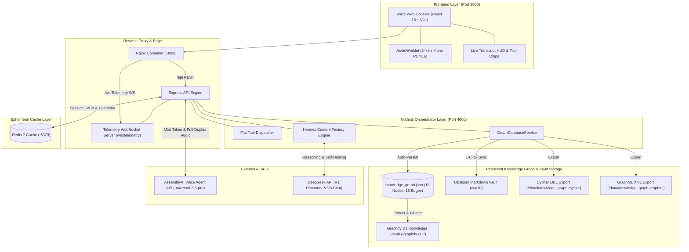
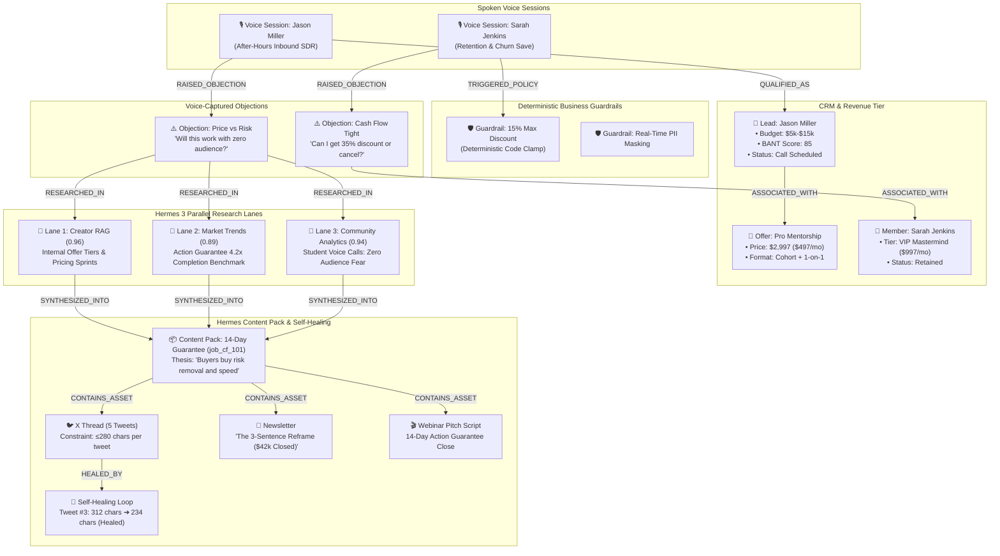
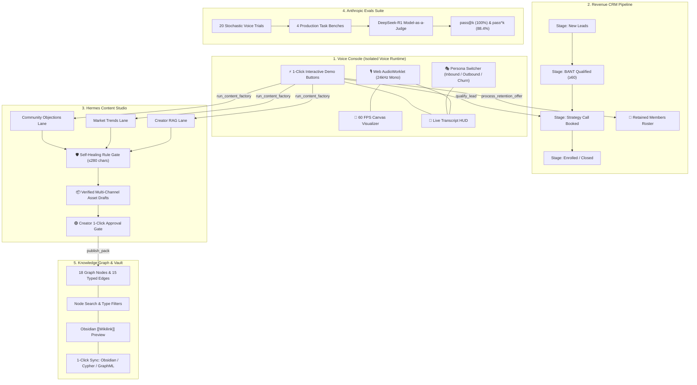
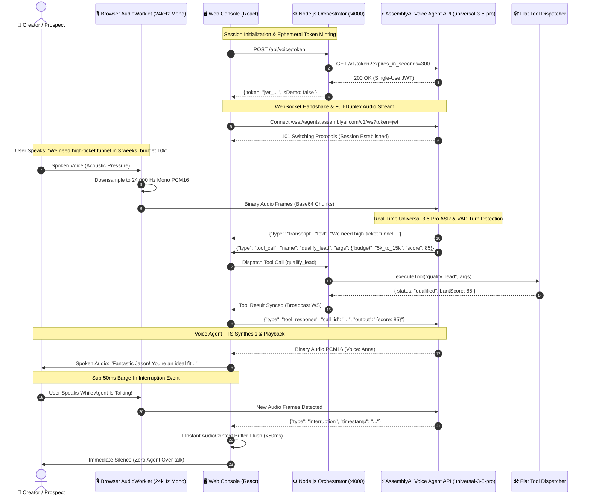
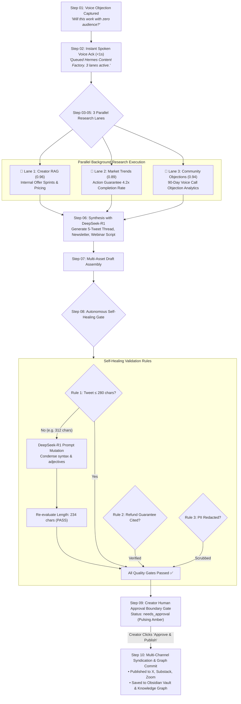
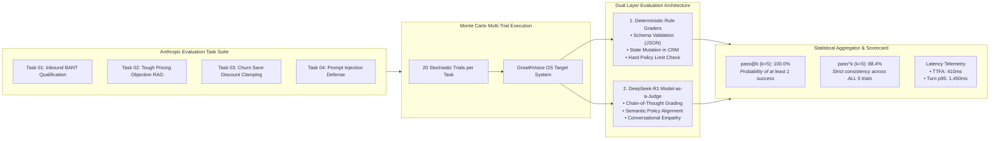
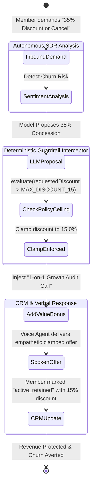
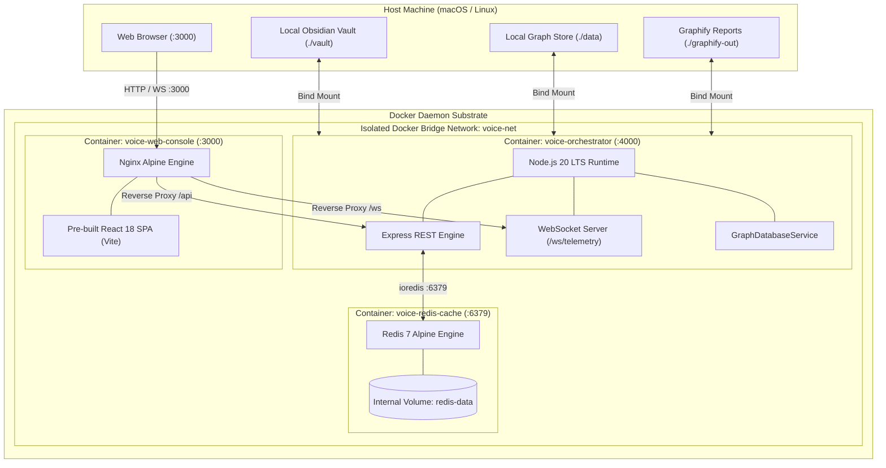
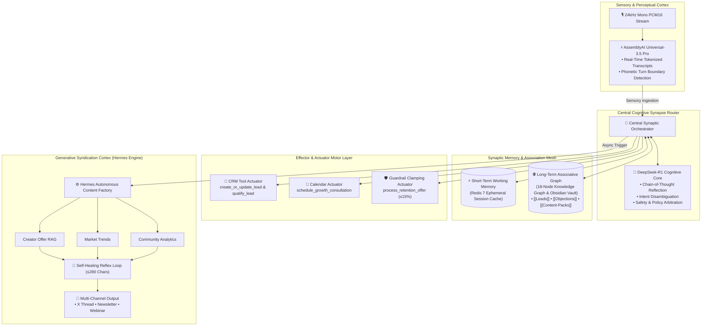

# 📐 GrowthVoice OS — Complete System Architecture & Diagram Index

This directory contains the official architectural diagrams, sequence flows, state machines, and component specifications for **GrowthVoice OS**, built for the **AssemblyAI Voice Agent Hackathon** on [lablab.ai](https://lablab.ai).

The diagrams incorporate standards from:
* **[Archify](https://github.com/tt-a1i/archify):** Typed Architecture Intermediate Representation (`archify-spec.json`), verifiable data flows, and layer separation.
* **[Synaptic](https://github.com/Synaptic-MCP/Synaptic):** Cognitive agentic mesh, sensory perception cortex, short/long-term synaptic memory fabric, and motor effector tool actuators.
* **Mermaid & Obsidian:** 100% native GitHub Markdown rendering + Obsidian Graph View compatibility.

---

## 🗂️ Diagram Index

| # | Diagram Name | File Link | Focus Area |
| :-: | :--- | :--- | :--- |
| **01** | **Storage & Data Lifecycle** | [`01_storage_data_flow.mmd`](01_storage_data_flow.mmd) | Ephemeral frontend state, Redis cache, and persistent Knowledge Graph / Obsidian Vault sync. |
| **02** | **Knowledge Graph Flywheel** | [`02_knowledge_graph_flywheel.mmd`](02_knowledge_graph_flywheel.mmd) | 18 nodes, 15 typed edges, and community clusters from voice inbound to content syndication. |
| **03** | **End-to-End Multi-Tab Architecture** | [`03_end_to_end_multitab_architecture.mmd`](03_end_to_end_multitab_architecture.mmd) | Tab separation and verification showing voice controls strictly isolated to Voice Console. |
| **04** | **Voice Agent & Sub-50ms Barge-In** | [`04_voice_agent_audio_worklet_bargein.mmd`](04_voice_agent_audio_worklet_bargein.mmd) | Full-duplex 24kHz mono PCM16, JWT token minting, VAD turn detection, and audio buffer flush. |
| **05** | **Hermes Content Factory & Self-Healing** | [`05_hermes_content_factory_self_healing.mmd`](05_hermes_content_factory_self_healing.mmd) | Raja Ashok 10-step blueprint, 3 parallel research lanes, and autonomous prompt mutation. |
| **06** | **Anthropic Evals & DeepSeek Judge** | [`06_anthropic_evals_deepseek_judge.mmd`](06_anthropic_evals_deepseek_judge.mmd) | $pass@k$ and $pass^k$ statistical scoring across 20 trials with Model-as-a-Judge grading. |
| **07** | **Deterministic Policy Clamping** | [`07_deterministic_policy_guardrail.mmd`](07_deterministic_policy_guardrail.mmd) | State machine enforcing 15% discount ceiling and injecting value-add growth audits. |
| **08** | **Docker Infrastructure & Isolation** | [`08_docker_infrastructure_isolation.mmd`](08_docker_infrastructure_isolation.mmd) | Microservices network topology, port mapping (3000, 4000, 6379), and host volume mounts. |
| **09** | **Synaptic Cognitive Agent Mesh** | [`09_synaptic_cognitive_agent_mesh.mmd`](09_synaptic_cognitive_agent_mesh.mmd) | Brain-inspired cognitive mesh connecting sensory cortex, working memory, and generative syndication. |
| **IR** | **Archify Typed Specification** | [`archify-spec.json`](archify-spec.json) | Archify-compliant JSON Intermediate Representation defining components, layers, and guardrails. |

---

## 1. Storage & Complete Data Lifecycle

---

## 2. Knowledge Graph Flywheel (Revenue & Content Mesh)

---

## 3. End-to-End Multi-Tab Architecture

---

## 4. Voice Agent & Sub-50ms Barge-In Pipeline

---

## 5. Hermes Content Factory & Autonomous Self-Healing

---

## 6. Anthropic Evals Suite & DeepSeek Model Judge

---

## 7. Deterministic Policy Clamping State Machine

---

## 8. Docker Infrastructure & Microservices Isolation

---

## 9. Synaptic Cognitive Agent Mesh

