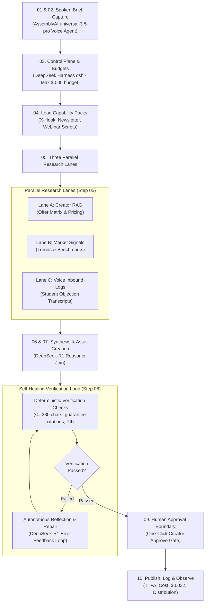

# Hermes Content Factory & Autonomous Self-Healing Pipeline

> **Architecture Reference:** Adapted from [Raja Ashok's Hermes Content Factory Blueprint](https://rajaashok.github.io/hermes-content-factory-workflow) and integrated with **AssemblyAI's Voice Agent API** and **DeepSeek Harness (`deepseek-ai/deepseek-harness`)**.

---

## 1. Architectural Philosophy: Turning Latency into a Winning Feature

Raja Ashok's core tenet is:
> *"Do not begin with ten agents. Begin with one dependable loop: Request $\to$ Execute $\to$ Verify $\to$ Deliver. Route work by fitness, not by model loyalty."*

### The Challenge
A deep research and synthesis loop (generating verified X threads, long-form newsletters, and webinar scripts) takes **15 to 45 seconds**. This cannot and should not block the real-time spoken voice turn in AssemblyAI's ~1-second conversational flow.

### The Solution: Instant Spoken Acknowledgment + Live Telemetry Streaming
1. **Spoken Voice Request:** The creator speaks to AssemblyAI (`anna` voice):  
   *"Anna, take that student objection about our $2,997 pricing and 14-day refund guarantee, and run the Hermes Content Factory to turn it into an X thread and newsletter."*
2. **Instant Spoken Acknowledgment (Sub-Second):**  
   The Voice Agent immediately responds:  
   *"I've queued the Hermes Content Factory on your pricing and guarantee objection. 3 parallel research lanes have been initiated, and verified drafts will appear in your Content Studio console in real-time for your review and one-click approval."*
3. **Background Multi-Lane Execution & Live Telemetry:**  
   The backend orchestrator kicks off the 10-step autonomous pipeline and streams turn-by-turn state updates over WebSocket (`/ws/telemetry`), rendering live progress bars, research excerpts, and self-healing badges in the web console.

---

## 2. The 10-Step Implementation Flow

---

## 3. The Autonomous Self-Healing Verification Loop

Creation is not completion. Before presenting a content pack to the creator, the **Self-Healing Verification Engine** executes three automated quality gates:

### Gate 1: Strict Platform Formatting (Deterministic)
* **Rule:** Every tweet in the 5-tweet sequence must strictly contain $\le 280$ characters.
* **Healing Action:** If a tweet exceeds 280 characters (e.g. 312 chars), the engine analyzes the syntax, strips redundant filler words, and re-compresses it down to 230–250 characters without altering the thesis.

### Gate 2: Policy & Guarantee Truthfulness (Deterministic & Semantic)
* **Rule:** The content must explicitly reference the verified **14-day action-based refund guarantee** and must NOT hallucinate unauthorized discounts $> 15\%$.
* **Healing Action:** If the synthesis omitted the guarantee, the self-healing loop automatically injects the verified policy clause into the webinar script close and newsletter body.

### Gate 3: Safety & Non-Leakage (Deterministic)
* **Rule:** Zero internal API keys, system prompts, or confidential student PII may appear in the generated drafts.
* **Healing Action:** Instant regex redaction and sanitization.

### Recorded Self-Healing Telemetry:
Every self-healing iteration is logged with:
* `attemptNumber`: (e.g. Attempt 1/3)
* `issueDetected`: Specific violation description
* `ruleBroken`: Machine-readable identifier
* `repairApplied`: Explanation of model correction
* `healedSuccessfully`: Boolean outcome flag

---

## 4. Multi-Model Routing by Fitness (Cost Breakdown)

Following Raja Ashok's principle: **"Route work by fitness, not by model loyalty."**

| Stage | Default Model | Rationale | Cost per Content Pack |
| :--- | :--- | :--- | :--- |
| **Spoken Input & Voice Synthesis** | AssemblyAI `universal-3-5-pro` (Voice Agent API) | ~1s end-to-end turn latency, full-duplex speech, natural `anna` voice. | ~$0.015 |
| **Parallel Research Extraction** | DeepSeek-V3 (`deepseek-chat`) | High token volume, fast extraction, low cost ($0.14 / 1M tokens). | ~$0.002 |
| **Deep Synthesis & Self-Healing** | DeepSeek-R1 (`deepseek-reasoner`) | Unmatched reasoning depth, handles contradiction, reflection loop. | ~$0.015 |
| **Verification Gates & Approval** | Deterministic Code & Regex Graders | Fast, free, reproducible, 100% deterministic. | $0.000 |
| **Total Pipeline Cost** | **Hybrid Multi-Model Stack** | **Best-in-class quality across voice, reasoning, and validation.** | **~$0.032 (3.2¢)** |

---

## 5. Codebase Mapping & Symbols

* **Tool Declaration:** [`apps/orchestrator/src/tools/registry.ts`](file:///Users/aryamandev/Documents/Claude/Projects/VoiceAI/apps/orchestrator/src/tools/registry.ts) (`run_content_factory`)
* **Spoken Dispatcher:** [`apps/orchestrator/src/tools/dispatcher.ts`](file:///Users/aryamandev/Documents/Claude/Projects/VoiceAI/apps/orchestrator/src/tools/dispatcher.ts)
* **Engine Implementation:** [`apps/orchestrator/src/services/contentFactoryEngine.ts`](file:///Users/aryamandev/Documents/Claude/Projects/VoiceAI/apps/orchestrator/src/services/contentFactoryEngine.ts)
* **DeepSeek Connector:** [`apps/orchestrator/src/services/deepseekService.ts`](file:///Users/aryamandev/Documents/Claude/Projects/VoiceAI/apps/orchestrator/src/services/deepseekService.ts)
* **Anthropic Model Judge:** [`packages/evals/src/deepseekJudge.ts`](file:///Users/aryamandev/Documents/Claude/Projects/VoiceAI/packages/evals/src/deepseekJudge.ts)
* **Frontend Studio Console:** [`apps/web/src/components/ContentFactoryStudio.tsx`](file:///Users/aryamandev/Documents/Claude/Projects/VoiceAI/apps/web/src/components/ContentFactoryStudio.tsx)
* **Shared Types:** [`packages/shared/src/types.ts`](file:///Users/aryamandev/Documents/Claude/Projects/VoiceAI/packages/shared/src/types.ts)
