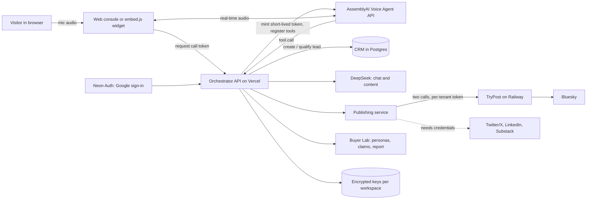
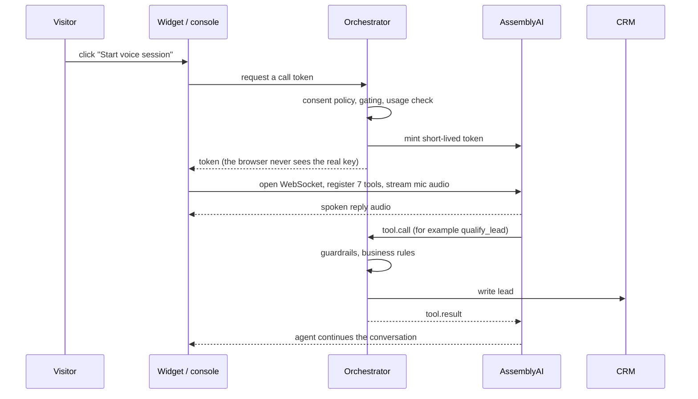
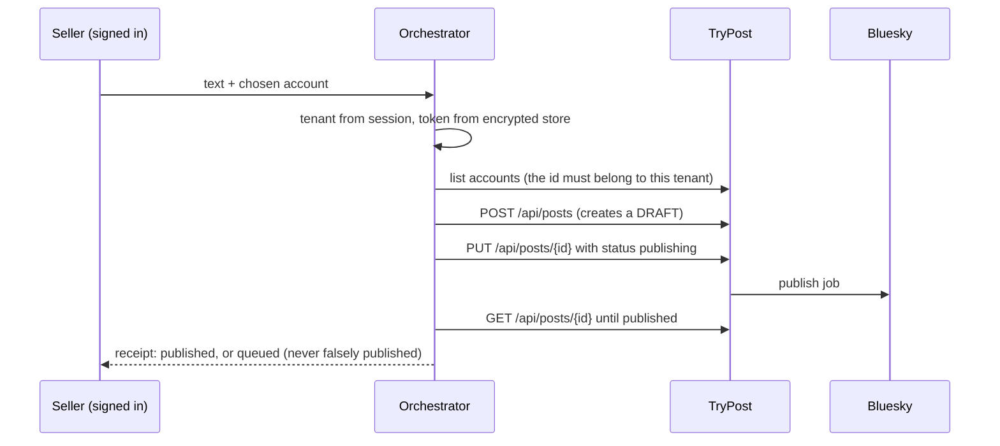

# StratosGTM: architecture and use cases

Written and verified 2026-09-26 against repo commit `db8d776` and the live endpoints at `stratosgtm.vercel.app`. This is the
honest, current picture: what the system is, how a request moves through it, who it is for, and, for every capability,
whether it is real today. It complements `ARCHITECTURE.md`, the older deep dive on the voice stack. Where the two
disagree, this file and `CLAUDE.md`'s status table win. If you change a capability, update the table in section 7.

Status labels used below:

- **Real**: works today with no extra setup.
- **Real when configured**: real once the named key or setting exists; otherwise a labeled simulation or a clear error.
- **Simulated**: produces labeled placeholder output; never presented as real.
- **Not built**: named so nobody assumes it exists.

## 1. One paragraph

StratosGTM is a voice-first growth system for people who sell high-ticket offers. A visitor talks to an agent on the
seller's site. The agent qualifies them and writes the lead into a CRM through registered tool calls. The same
conversations feed a content pipeline that drafts posts and publishes them. A separate tool, Buyer Lab, simulates how
buyers would react to a page or offer, and cites the exact quote behind every claim. Every publish and every key is
tenant-scoped, and anything that is not a real third-party call says so.

## 2. System at a glance

| Piece | Runs on | Purpose |
|---|---|---|
| Web console, landing, pricing | Vercel (React 18, Vite) | The demo, sign-in, Keys panel, Buyer Lab, publishing control. |
| Orchestrator API | Vercel (Express, TypeScript) | Token minting, tool execution, CRM, content, billing, publishing, Buyer Lab. |
| Voice | AssemblyAI Voice Agent API | Speech in, speech out, turn detection, tool calling. |
| Language model | DeepSeek | Chat, content synthesis, Buyer Lab personas and reports. |
| Data | Neon Postgres | Leads, members, consent, encrypted credentials, Buyer Lab runs. |
| Auth | Neon Auth (Google) | Each account gets a private workspace. |
| Billing | Stripe (test mode today) | Subscriptions, activated only by a signed webhook. |
| Publishing bridge | TryPost on Railway (AGPL, run as a separate service; only config changed in our fork) | One HTTP API in front of many social networks. |
| Simulated-buyer research | Buyer Lab (native engine) | Hypotheses about buyer reactions, with quotes. |

## 3. How a voice call works

The seven registered tools (read from the live `/api/voice/config` on 2026-09-26):

| Tool | What it does | Honest note |
|---|---|---|
| `create_or_update_lead` | Creates or updates the lead in the CRM | Real |
| `qualify_lead` | Records budget, timeline and fit | Real |
| `enrich_prospect_dossier` | Builds a prospect dossier | Real when configured (uses the language model) |
| `get_product_knowledge` | Answers product questions | **Simulated**: keyword lookup over four hard-coded documents, no embeddings |
| `schedule_growth_consultation` | Records a consultation request | **Not a calendar**: writes a confirmation code into the lead only |
| `process_retention_offer` | Handles a churn-save conversation | Real, with an enforced discount ceiling |
| `run_content_factory` | Starts the content pipeline from the call | Real when configured |

What is real: token minting, tool execution over HTTP into the CRM, and the US disclosure and consent layer
(engineering implementation, not legal advice). What is not measured: time to first audio. **No latency figure may be
quoted until real calls have been measured.**

## 4. How content becomes a published post

Rules that make the receipt trustworthy: a receipt is real only after TryPost itself reports `published`; anything short
of that is `queued` and still marked simulated. Proven end to end on Bluesky on 2026-09-26. Details and failure modes:
`docs/superpowers/specs/2026-09-26-trypost-operations.md`.

## 5. Buyer Lab: simulated buyers, honestly

Buyer Lab reads a page or offer and runs LLM-simulated buyer personas over it. The output is **hypotheses, not
measurements**. Every claim must carry a verbatim quote found in the material that persona was shown; claims without one
are dropped and counted. No probability, conversion or revenue figure is ever produced. The report cites claim ids only.

One real-model check (2026-09-21, a public site only): 6 personas, 45 claims kept and 3 dropped (94% verifiable), 6 model
calls at a few cents. It needs a workspace with its own DeepSeek key or an owner's server-key grant; there are no free
credits.

## 6. Trust model

| Rule | How it is enforced |
|---|---|
| Each account sees only its own data | Neon Auth workspaces; every query is scoped by the session's tenant id. |
| Keys never leak | AES-256-GCM per-row data keys; only the last four characters are ever shown; no decrypted secret is logged. |
| No free credits | A workspace uses its own keys, an owner grant, or a paid plan; otherwise it gets 402. |
| Nothing pretends to be real | Every publish receipt carries `isSimulated`, derived in one place, true unless a real call succeeded. |
| Claims are grounded | Buyer Lab claims need a verbatim quote; reports cite claim ids only. |
| Consent first | Disclosure prepended; explicit opt-in in the 13 all-party-consent states (CA, CT, DE, FL, IL, MD, MA, MI, MT, NV, NH, PA, WA); records are append-only. |

## 7. Capability status (condensed from `CLAUDE.md`)

| Capability | Status |
|---|---|
| Voice calls in the browser, seven CRM tools | **Real when configured** (AssemblyAI key) |
| Embeddable widget (`embed.js`) | **Real when configured** |
| AI disclosure and consent | **Real** |
| Sign-in and private workspaces | **Real when configured** (Neon Auth) |
| Bring-your-own keys, encrypted | **Real when configured** (database and master key) |
| Chat and content synthesis | **Real when configured** (DeepSeek); labeled fallback otherwise |
| Publishing to Bluesky via TryPost | **Real when configured**; proven live |
| Publishing to Twitter/X and LinkedIn | **Real when configured** (complete credentials and real publishing on) |
| Publishing to Substack | **Real when configured** (webhook) |
| Publishing to YouTube | **Not built** (labeled stub) |
| Instagram, Facebook, Threads and others | **Not built here**: TryPost supports them, but each needs platform app registration; only Bluesky is enabled |
| Buyer Lab | **Real when configured** (own DeepSeek key or owner grant) |
| Usage metering | **Real** at token mint time; widget calls are not instrumented |
| Billing | **Real when configured**, test mode only |
| Calendar booking | **Not built** |
| Document search (RAG) | **Not built** (four hard-coded documents) |
| Latency and eval metrics | **Not measured yet**; do not quote |

## 8. Use cases

Who it is for: founders, creators and agencies selling offers of about $2,000 and up, where one extra qualified lead is
worth real money and slow follow-up hurts.

| # | Use case | Who | What happens | Real today? |
|---|---|---|---|---|
| 1 | After-hours inbound qualification | Founder with a high-ticket program | A visitor talks to the agent on the site; budget, timeline and fit are captured; the lead lands in the CRM with the consultation request recorded. | Real when configured |
| 2 | Embedded agent on a landing page | Creator or educator | One script tag puts the agent on the page, scoped to allowed origins. | Real when configured |
| 3 | Sales call to content | Any of the three | Conversation topics become drafts for X, LinkedIn and Substack, and a Bluesky post can go out through TryPost. | Real when configured; other networks manual |
| 4 | Pre-launch offer testing | Founder about to spend on a launch | Buyer Lab runs simulated buyers over the page and returns quote-backed hypotheses about objections and unclear claims. | Real when configured |
| 5 | Agency running several brands | Agency owner | Separate credentials and exports per client brand. | Real when configured |
| 6 | Retention conversations | Creator with a cohort or membership | A churn-save persona with a hard ceiling on discounts, so the agent cannot give away margin. | Real (persona and guardrail) |
| 7 | Honest reporting to a client | Agency | Every receipt says published, queued or simulated, so nothing is over-reported. | Real |
| 8 | Hackathon and demo mode | Judges and prospects | Anonymous demo sessions, capped at five minutes. | Real |

## 9. Known limits (say these out loud)

- Time to first audio is not measured, so there is no speed claim.
- Widget calls are not metered and not attributed.
- Only Bluesky is connected for one-click publishing; publishing to other networks is manual until they are enabled.
- The TryPost instance is small (1 GB) and was unstable until Horizon was trimmed; it is steady now but is a single instance.
- Sign-in uses Neon's shared development Google keys, which are not meant for production; move to your own OAuth client before real customers sign in.
- The name "Stratos" is used by other companies in adjacent spaces; a trademark search has not been done.
- There is no idempotency key on Publish, so a double click can post twice.
