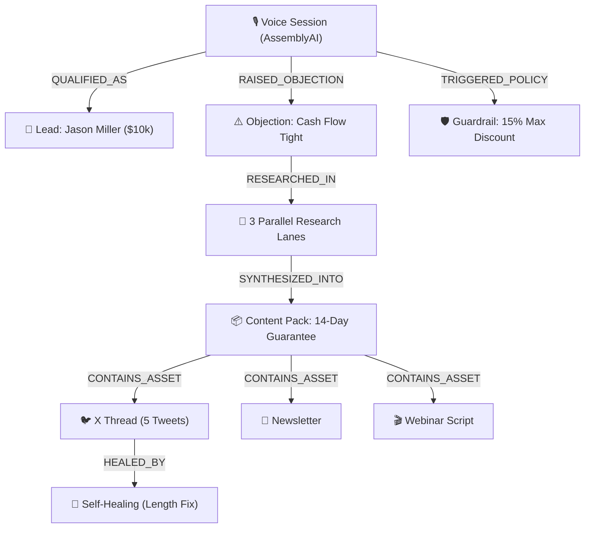

# 🎙️ GrowthVoice OS — Knowledge & Revenue Graph

Welcome to the **GrowthVoice OS** persistent vault. This vault connects real-time **AssemblyAI** voice interactions with autonomous **DeepSeek-R1** content synthesis, CRM lead qualification, and self-healing business guardrails.

> [!important] Autonomous Operating System
> Voice conversations are immediately parsed into **BANT qualifications**, **pricing objections**, and **multi-channel content marketing packs** with deterministic guardrails preventing unauthorized discounting.

## 📊 Live System Topology (Mermaid)

## 🗂️ Knowledge Vault Sections

- [[Clients/DesignAcademy_Studio/Dossier|Client Dossier: Jason Miller (DesignAcademy Studio)]] — Score 85/100.

- [[Clients/DesignAcademy_Studio/BrandVoice|Brand Voice: DesignAcademy Studio (Enterprise Advisor)]]

- [[Guides/Private_Dossiers_and_Local_Vault_Setup|🔒 Private Dossiers, Local Vault Protection & Mac Restart Guide]]
- [[Infrastructure/Starred_Repositories_Architecture|🌟 Starred Repositories Architecture & Infrastructure Roadmap]]

- [[Clients/DesignAcademy_Studio/BrandVoice|Brand Voice: DesignAcademy Studio (Tactical Operator / Public Demo)]]
- [[Clients/DesignAcademy_Studio/Dossier|Client Dossier: Jason Miller (DesignAcademy Studio / Public Demo)]] — Score 85/100.

- [[Leads/lead_jason_miller|Lead: Jason Miller]] — Score 85, $5k-$15k budget, booked for consultation.
- [[Members/member_sarah_jenkins|Member: Sarah Jenkins]] — Retained mastermind member, 15% clamped discount applied.
- [[Voice-Sessions/session_inbound_jason|Voice Session: Inbound Jason]] — AssemblyAI 24kHz stream transcript & telemetry.
- [[Objections/obj_cashflow_tight|Objection: Cash Flow Tight]] — Churn risk objection and policy resolution.
- [[Content-Packs/pack_cf_101|Content Pack: 14-Day Guarantee]] — DeepSeek-R1 synthesized multi-asset marketing pack.
- [[Self-Healing/heal_tweet_3_length|Self-Healing: Tweet 3 Length]] — Autonomous self-repair audit log (312 -> 234 chars).
- [[Policies/policy_max_discount_15|Policy: Max 15 Percent Discount]] — Deterministic business guardrail rule.

## 📈 Graph Statistics
- **Total Nodes:** 18
- **Total Edges:** 15
- **Updated:** `2026-09-06T23:28:24.126Z`
